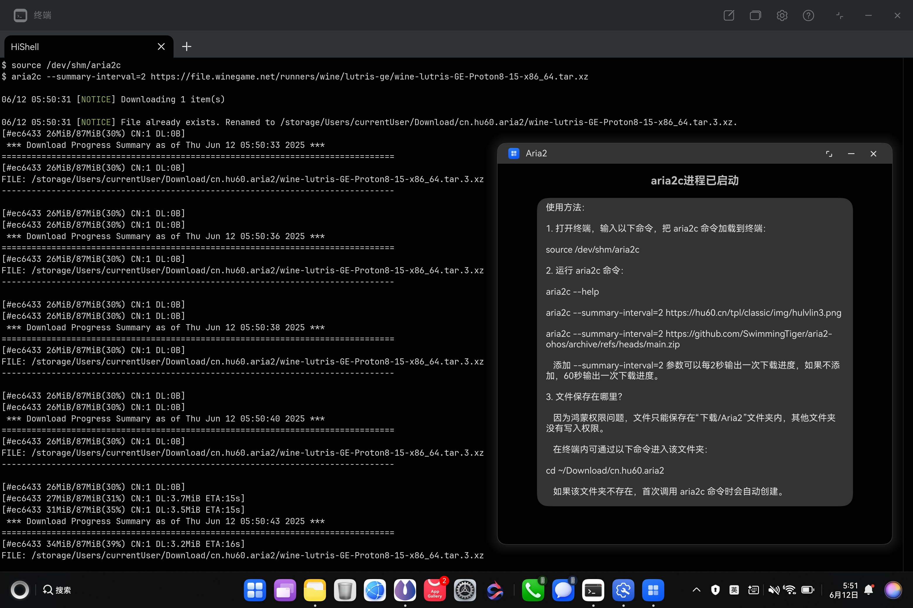
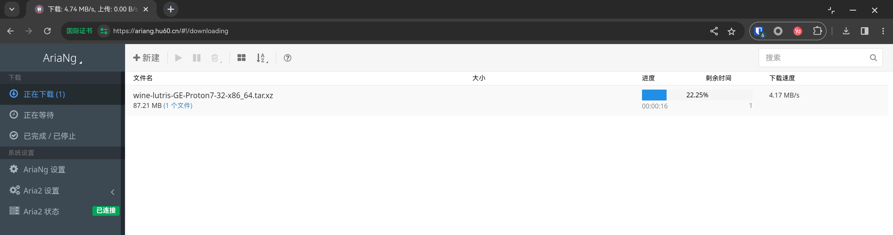

## 鸿蒙PC上的命令行版 Aria2（aria2c）



### 使用方法：

0. 去Release页面（[Gitee](https://gitee.com/SwimmingTiger/aria2-ohos/releases)|[Github](https://github.com/SwimmingTiger/aria2-ohos/releases)）下载`cn.hu60.aria2-vx.x.x.hap`安装包，并用[小白调试助手](https://github.com/likuai2010/auto-installer/releases)安装。

   首次安装需要打开开发者模式，借助Windows虚拟机（也可以用另一台电脑，或者安卓手机、鸿蒙手机）把小白调试助手鸿蒙版安装到鸿蒙PC上。后续双击hap即可用鸿蒙版小白调试助手进行安装。

   Windows虚拟机安装小白调试助手教程：[https://www.bilibili.com/video/BV1ZETBzuEjD/](https://www.bilibili.com/video/BV1ZETBzuEjD/)

2. 打开 Aria2 应用，不要关闭其窗口。打开终端，输入以下命令，把 aria2c 命令加载到终端：

    ```
    source /dev/shm/aria2c
    ```

3. 运行 aria2c 命令：

    ```
    aria2c --help
    
    aria2c --summary-interval=2 https://hu60.cn/tpl/classic/img/hulvlin3.png
    
    aria2c --summary-interval=2 https://github.com/SwimmingTiger/aria2-ohos/archive/refs/heads/main.zip
  
    # 多线程下载
    aria2c --summary-interval=2 -x5 -s5 https://github.com/GloriousEggroll/wine-ge-custom/releases/download/GE-Proton8-26/wine-lutris-GE-Proton8-26-x86_64.tar.xz
    ```

   添加 --summary-interval=2 参数可以每2秒输出一次下载进度，如果不添加，60秒输出一次下载进度。

4. 使用基于网页的 AriaNG 图形界面进行下载任务管理：

   在终端执行以下命令打开RPC：

   ```
   source /dev/shm/aria2c
   aria2c --enable-rpc --rpc-listen-all --rpc-allow-origin-all
   ```

   然后访问以下网站进行使用：

   https://ariang.hu60.cn/#!/settings/rpc/set/http/127.0.0.1/6800/jsonrpc

   

4. 文件保存在哪里？

   因为鸿蒙权限问题，文件只能保存在“下载/Aria2”文件夹内，其他文件夹没有写入权限。

   在终端内可通过以下命令进入该文件夹：

    ```
    cd ~/Download/cn.hu60.aria2
    ```

   如果该文件夹不存在，首次调用 aria2c 命令时会自动创建。

   你可以在该文件夹内创建子文件夹并cd进去，随后调用aria2c命令就会下载到你进入的文件夹。

   但是如果你进入的文件夹不是 ~/Download/cn.hu60.aria2 的子文件夹，
   aria2c 命令就会自动跳转到 ~/Download/cn.hu60.aria2 文件夹。

5. 如果 aria2c 进程启动失败，查看错误信息：

    ```
    cat /dev/shm/cn.hu60.aria2.stderr
    cat /dev/shm/cn.hu60.aria2.stdout
    ```

6. 项目源代码：

  * https://github.com/SwimmingTiger/aria2-ohos
  
  * https://github.com/SwimmingTiger/aria2

### 开发文档

* [鸿蒙 PC /dev/shm 共享内存文件系统的特点](docs/dev-shm.md)
