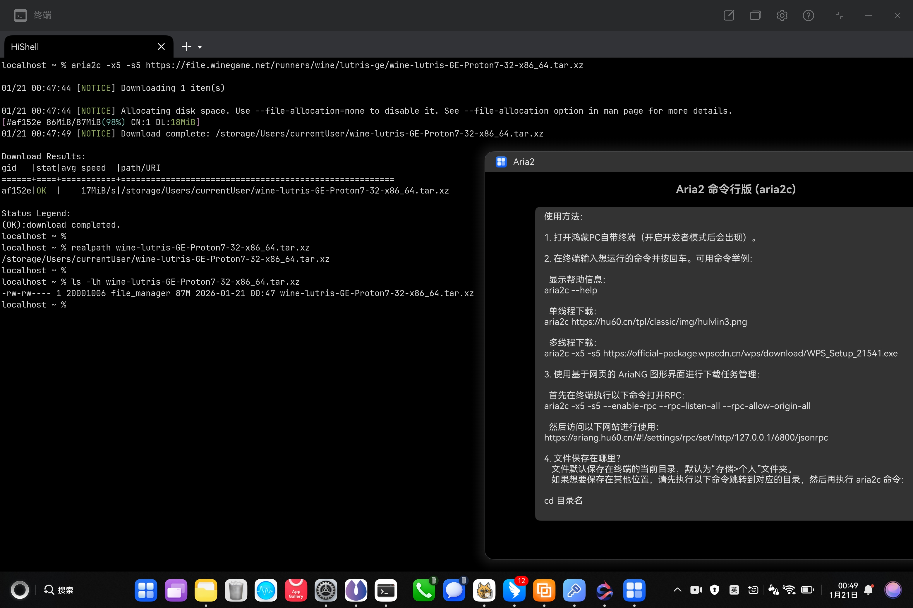
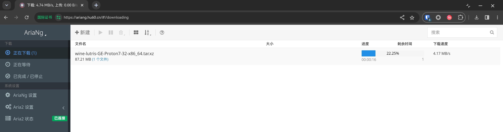

## 鸿蒙PC上的命令行版 Aria2（aria2c）



### 安装方法：

请用小白调试助手Windows版进行安装，安卓版和鸿蒙版无法给含有hnp的hap签名。

小白调试助手下载地址：https://github.com/likuai2010/auto-installer/releases

升级到鸿蒙6之后可以在Windows虚拟机内运行小白调试助手（鸿蒙5不行），如果遇到“系统找不到指定的文件”报错，请安装Windows ARM64版JDK。

Windows ARM64 JDK下载地址：https://learn.microsoft.com/zh-cn/java/openjdk/download

### 使用方法：

1. 打开鸿蒙PC自带终端（开启开发者模式后会出现）。

2. 在终端输入想运行的命令并按回车。可用命令举例：

#### 显示帮助信息：
```
aria2c --help
```

#### 单线程下载：
```
aria2c https://hu60.cn/tpl/classic/img/hulvlin3.png
```

#### 多线程下载：
```
aria2c -x5 -s5 https://official-package.wpscdn.cn/wps/download/WPS_Setup_21541.exe
```

 3. 使用基于网页的 AriaNG 图形界面进行下载任务管理：

   在终端执行以下命令打开RPC：

   ```
   aria2c -x5 -s5 --enable-rpc --rpc-listen-all --rpc-allow-origin-all
   ```

   然后访问以下网站进行使用：https://ariang.hu60.cn/#!/settings/rpc/set/http/127.0.0.1/6800/jsonrpc

   

4. 文件保存在哪里？
   文件默认保存在终端的当前目录，默认为“存储>个人”文件夹。
   如果想要保存在其他位置，请先执行以下命令跳转到对应的目录，然后再执行 aria2c 命令：

```
cd 目录名
```

   例如，保存到下载文件夹：

```
cd Download
aria2c -x5 -s5 https://official-package.wpscdn.cn/wps/download/WPS_Setup_21541.exe
```

5. 如何取消任务？
   同时按 Ctrl 和 C 键可以取消任务。如果没反应，就再按一下回车键。

6. 技术细节：
   你可以在以下位置找到本应用添加到终端的命令文件：

```
ls /data/service/hnp
find /data/service/hnp/cn-hu60-aria2.org
```

7. 更新日志

【v1.0.1】
    1. 改用 hnp 打包，不需要执行 source /dev/shm/aria2c 命令就可直接调用 aria2c 命令。
    2. 关闭本应用窗口后依然可以正常调用 aria2c 命令。
    3. 由于终端可以直接执行原始 aria2c 命令，1.0 版本的文件权限问题不再存在，现在文件可保存至所有终端可以 cd 进入的文件夹。
    4. 1.0 版本中由于输入输出重定向导致的下载进度无法及时更新的问题也得到解决。
    感谢 Jiajie Chen 的 Termony 项目 <https://github.com/jiegec/Termony> 提供了 hnp 打包方法。

8. 项目源代码：
https://gitee.com/SwimmingTiger/aria2-ohos
https://github.com/SwimmingTiger/aria2-ohos
